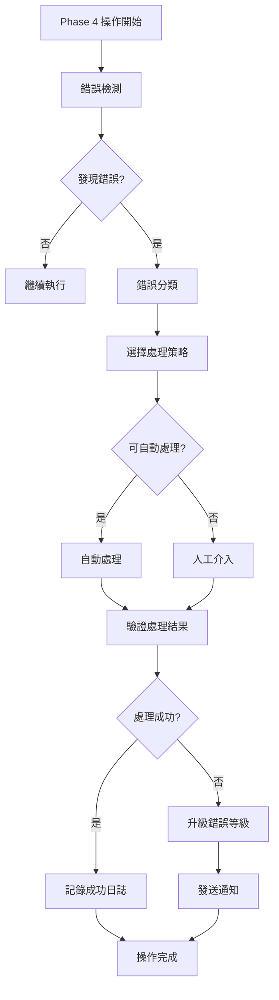

# Phase 4 錯誤處理框架設計文件

## 系統概覽

Phase 4 錯誤處理框架是一個專門為「帳本關聯與支出真實化」功能設計的錯誤處理系統，確保代墊款追蹤器與主帳本之間的資料一致性和操作可靠性。

## 架構設計

### 核心組件架構

```
┌─────────────────────────────────────────────────────────────┐
│                    Phase 4 錯誤處理框架                        │
├─────────────────────────────────────────────────────────────┤
│  ┌─────────────────┐  ┌─────────────────┐  ┌─────────────────┐ │
│  │   錯誤檢測器     │  │   錯誤分類器     │  │   錯誤處理器     │ │
│  │ ErrorDetector   │  │ ErrorClassifier │  │ ErrorHandler    │ │
│  └─────────────────┘  └─────────────────┘  └─────────────────┘ │
├─────────────────────────────────────────────────────────────┤
│  ┌─────────────────┐  ┌─────────────────┐  ┌─────────────────┐ │
│  │   事務管理器     │  │   一致性檢查器   │  │   恢復管理器     │ │
│  │TransactionMgr   │  │ConsistencyChk   │  │ RecoveryMgr     │ │
│  └─────────────────┘  └─────────────────┘  └─────────────────┘ │
├─────────────────────────────────────────────────────────────┤
│  ┌─────────────────┐  ┌─────────────────┐  ┌─────────────────┐ │
│  │   通知管理器     │  │   日誌管理器     │  │   監控管理器     │ │
│  │NotificationMgr  │  │   LogManager    │  │  MonitorMgr     │ │
│  └─────────────────┘  └─────────────────┘  └─────────────────┘ │
└─────────────────────────────────────────────────────────────┘
```

### 錯誤分類體系

#### 1. 系統級錯誤 (System Errors)
- **網路錯誤** (NetworkError)
- **API 限制錯誤** (APILimitError)  
- **權限錯誤** (PermissionError)
- **服務不可用錯誤** (ServiceUnavailableError)

#### 2. 資料級錯誤 (Data Errors)
- **資料不一致錯誤** (DataInconsistencyError)
- **資料格式錯誤** (DataFormatError)
- **資料衝突錯誤** (DataConflictError)
- **資料完整性錯誤** (DataIntegrityError)

#### 3. 業務級錯誤 (Business Errors)
- **帳本關聯錯誤** (LedgerLinkError)
- **支出真實化錯誤** (ExpenseRealizationError)
- **金額計算錯誤** (AmountCalculationError)
- **重複檢測錯誤** (DuplicateDetectionError)

#### 4. 使用者級錯誤 (User Errors)
- **輸入驗證錯誤** (InputValidationError)
- **操作序列錯誤** (OperationSequenceError)
- **權限不足錯誤** (InsufficientPermissionError)

## 詳細設計

### 1. 錯誤檢測器 (ErrorDetector)

```javascript
class Phase4ErrorDetector {
  // 檢測帳本關聯錯誤
  detectLedgerLinkErrors(iouData, mainLedgerData) {
    // 實作邏輯
  }
  
  // 檢測資料一致性錯誤
  detectConsistencyErrors(beforeState, afterState) {
    // 實作邏輯
  }
  
  // 檢測支出真實化錯誤
  detectExpenseRealizationErrors(expenseData) {
    // 實作邏輯
  }
}
```

### 2. 事務管理器 (TransactionManager)

```javascript
class Phase4TransactionManager {
  // 開始事務
  beginTransaction(transactionId) {
    // 記錄事務開始狀態
  }
  
  // 提交事務
  commitTransaction(transactionId) {
    // 確認所有操作成功
  }
  
  // 回滾事務
  rollbackTransaction(transactionId) {
    // 恢復到事務開始前的狀態
  }
}
```

### 3. 一致性檢查器 (ConsistencyChecker)

```javascript
class Phase4ConsistencyChecker {
  // 檢查 IOU 與主帳本一致性
  checkIouMainLedgerConsistency() {
    // 比對相關記錄
  }
  
  // 檢查金額一致性
  checkAmountConsistency(iouRecord, mainRecord) {
    // 驗證金額匹配
  }
  
  // 生成一致性報告
  generateConsistencyReport() {
    // 產生詳細報告
  }
}
```

## 錯誤處理流程

### 主要處理流程



### 錯誤處理策略

#### 1. 自動重試策略
```javascript
const RETRY_STRATEGIES = {
  NetworkError: {
    maxRetries: 3,
    backoffMultiplier: 2,
    initialDelay: 1000
  },
  APILimitError: {
    maxRetries: 5,
    backoffMultiplier: 3,
    initialDelay: 5000
  }
};
```

#### 2. 降級處理策略
```javascript
const FALLBACK_STRATEGIES = {
  LedgerLinkError: 'MANUAL_REVIEW',
  DataInconsistencyError: 'CONSERVATIVE_MODE',
  ExpenseRealizationError: 'PARTIAL_PROCESSING'
};
```

## 資料結構設計

### 錯誤記錄結構
```javascript
const ErrorRecord = {
  errorId: 'string',           // 唯一錯誤 ID
  timestamp: 'Date',           // 發生時間
  errorType: 'string',         // 錯誤類型
  severity: 'string',          // 嚴重程度 (LOW/MEDIUM/HIGH/CRITICAL)
  source: 'string',            // 錯誤來源
  context: 'object',           // 錯誤上下文
  stackTrace: 'string',        // 錯誤堆疊
  affectedRecords: 'array',    // 受影響的記錄
  handlingStrategy: 'string',  // 處理策略
  resolution: 'object',        // 解決方案
  status: 'string'             // 處理狀態
};
```

### 事務記錄結構
```javascript
const TransactionRecord = {
  transactionId: 'string',     // 事務 ID
  startTime: 'Date',           // 開始時間
  endTime: 'Date',             // 結束時間
  operations: 'array',         // 操作列表
  status: 'string',            // 事務狀態
  rollbackData: 'object'       // 回滾資料
};
```

## 效能考量

### 1. 非阻塞錯誤處理
- 錯誤日誌寫入使用非同步方式
- 通知發送不阻塞主要流程
- 一致性檢查在背景執行

### 2. 快取機制
- 快取常見錯誤的處理結果
- 快取一致性檢查結果
- 快取配置資訊

### 3. 批次處理
- 批次處理多個錯誤
- 批次發送通知
- 批次更新錯誤狀態

## 監控與告警

### 監控指標
- 錯誤發生率
- 錯誤處理成功率
- 平均處理時間
- 資料一致性指標

### 告警規則
- 錯誤率超過閾值
- 連續處理失敗
- 資料不一致檢測
- 系統資源異常

## 測試策略

### 單元測試
- 各個錯誤檢測器的測試
- 錯誤處理邏輯的測試
- 事務管理的測試

### 整合測試
- 端到端錯誤處理流程測試
- 多組件協作測試
- 外部依賴錯誤模擬測試

### 壓力測試
- 大量錯誤同時發生的處理能力
- 長時間運行的穩定性
- 資源消耗測試

## 安全考量

### 1. 錯誤資訊安全
- 避免在錯誤訊息中洩露敏感資訊
- 錯誤日誌的存取控制
- 敏感操作的審計記錄

### 2. 防禦性程式設計
- 輸入驗證和清理
- 邊界條件檢查
- 異常情況的安全處理

## 擴展性設計

### 1. 插件化架構
- 支援自定義錯誤檢測器
- 支援自定義處理策略
- 支援自定義通知方式

### 2. 配置驅動
- 錯誤處理策略可配置
- 通知規則可配置
- 監控閾值可配置