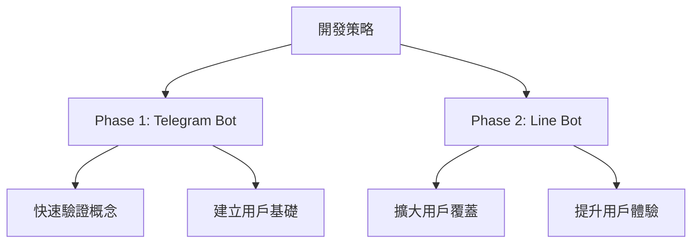
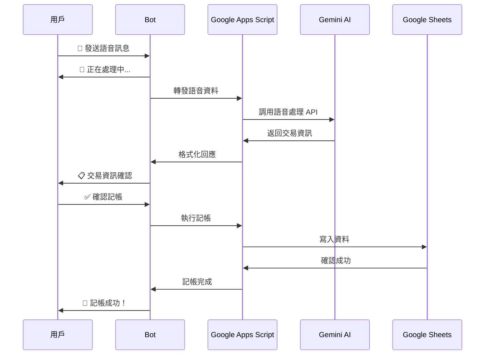

# Bot 整合記帳系統設計方案

## 📋 **專案概述**

### **目標**
將現有的智慧記帳系統整合 Line Bot 和 Telegram Bot，讓用戶可以透過聊天機器人進行拍照和語音記帳，提供更便利的使用體驗。

### **核心價值**
- 🚀 **便利性**: 隨時隨地透過手機聊天軟體記帳
- 🤖 **智慧化**: 結合現有的 Gemini AI 分析能力
- 📱 **普及性**: 利用用戶熟悉的通訊軟體
- 🔄 **整合性**: 與現有系統無縫整合

---

## 🤖 **平台比較分析**

### **Line Bot**

#### **優勢**
- ✅ **高普及率**: 台灣用戶覆蓋率極高，幾乎人人都有
- ✅ **豐富 UI**: 支援 Flex Message、Quick Reply、Rich Menu 等
- ✅ **多媒體支援**: 圖片、語音、影片、位置等完整支援
- ✅ **群組功能**: 強大的群組互動功能
- ✅ **官方感**: 用戶信任度高，適合正式服務

#### **劣勢**
- ❌ **開發複雜**: 需要 Line Developer 帳號申請和審核
- ❌ **費用考量**: 超過免費額度需付費 (1000 則訊息/月免費)
- ❌ **審核機制**: 功能更新需要審核時間
- ❌ **API 限制**: 某些功能有使用限制

#### **技術規格**
- **Webhook URL**: 需要 HTTPS 端點
- **訊息格式**: JSON 格式，結構較複雜
- **檔案處理**: 需要透過 Content API 下載
- **推送限制**: 需要用戶先互動才能推送

### **Telegram Bot**

#### **優勢**
- ✅ **開發簡單**: API 簡潔直觀，快速上手
- ✅ **完全免費**: 無訊息量限制，永久免費
- ✅ **功能強大**: Inline Keyboard、檔案上傳、群組管理等
- ✅ **無需審核**: 建立後立即可用
- ✅ **開放性**: 高度自訂化，功能限制少

#### **劣勢**
- ❌ **普及率低**: 台灣使用者相對較少
- ❌ **介面簡單**: UI 元件不如 Line 豐富
- ❌ **品牌認知**: 部分用戶對 Telegram 不熟悉
- ❌ **群組限制**: 某些企業可能限制使用

#### **技術規格**
- **Webhook URL**: 支援 HTTP/HTTPS
- **訊息格式**: 簡潔的 JSON 結構
- **檔案處理**: 直接提供下載連結
- **推送自由**: 可主動推送訊息給用戶

### **建議策略**


---

## 🏗️ **系統架構設計**

### **整體架構圖**
```
┌─────────────────┐    ┌─────────────────┐
│   Line Bot      │    │  Telegram Bot   │
│   (Phase 2)     │    │   (Phase 1)     │
└─────────┬───────┘    └─────────┬───────┘
          │                      │
          └──────────┬───────────┘
                     │
          ┌──────────▼───────────┐
          │  Google Apps Script  │
          │   Bot Handler        │
          │  (新增 Bot 處理層)    │
          └──────────┬───────────┘
                     │
          ┌──────────▼───────────┐
          │    現有 AI 處理層     │
          │ callGeminiForVision  │
          │ callGeminiForVoice   │
          │ callGeminiForEmail   │
          └──────────┬───────────┘
                     │
          ┌──────────▼───────────┐
          │   Google Sheets      │
          │     記帳資料庫        │
          └──────────────────────┘
```

### **技術棧整合**
- **前端**: Line/Telegram 客戶端
- **中間層**: Google Apps Script (新增 Bot 處理函數)
- **AI 處理**: 現有的 Gemini API 整合
- **資料儲存**: 現有的 Google Sheets 結構
- **檔案儲存**: Google Drive (圖片和語音檔案)

### **核心優勢**
1. **重用現有邏輯**: 最大化利用現有的 AI 處理和記帳邏輯
2. **統一資料源**: 所有記帳資料集中在同一個 Google Sheets
3. **多入口整合**: Web App + Bot + 郵件自動處理並存
4. **漸進式開發**: 可以逐步增加功能，不影響現有系統

---

## 📱 **用戶體驗設計**

### **圖片記帳流程**


### **語音記帳流程**


### **互動式功能設計**

#### **主選單 (Rich Menu/Inline Keyboard)**
```
┌─────────┬─────────┬─────────┐
│ 📸 拍照  │ 🎤 語音  │ ✏️ 手動  │
│   記帳   │   記帳   │   記帳   │
├─────────┼─────────┼─────────┤
│ 📊 查詢  │ 📋 報表  │ ⚙️ 設定  │
│   支出   │   分析   │   功能   │
└─────────┴─────────┴─────────┘
```

#### **快速記帳模板**
- 🍽️ **餐飲**: 早餐 $50、午餐 $100、晚餐 $150
- 🚗 **交通**: 捷運 $20、公車 $15、計程車 $100
- 🛒 **購物**: 日用品、服飾、3C產品
- 💊 **醫療**: 看診、藥品、健檢

#### **查詢功能**
- 📅 **今日支出**: 顯示當日所有記錄
- 📊 **本月統計**: 月度支出分析
- 🏷️ **分類查詢**: 按類別顯示支出
- 🔍 **關鍵字搜尋**: 搜尋特定商店或項目

---

## 🔧 **技術實作規劃**

### **Google Apps Script 新增函數結構**

#### **Bot 處理核心**
```javascript
// Bot Webhook 主處理函數
function doPost_Bot(e) {
  // 判斷來源平台 (Line/Telegram)
  // 解析訊息格式
  // 路由到對應處理函數
}

// Line Bot 專用處理
function handleLineBot(event) {
  // Line 訊息格式處理
  // 調用通用處理邏輯
}

// Telegram Bot 專用處理
function handleTelegramBot(update) {
  // Telegram 訊息格式處理
  // 調用通用處理邏輯
}
```

#### **多媒體處理**
```javascript
// 圖片處理 (重用現有邏輯)
function processBotImage(imageUrl, platform, userId) {
  // 下載圖片 → Blob
  // 調用 callGeminiForVision()
  // 格式化回應給 Bot
}

// 語音處理 (重用現有邏輯)
function processBotVoice(voiceUrl, platform, userId) {
  // 下載語音 → 轉文字或直接處理
  // 調用 callGeminiForVoice()
  // 格式化回應給 Bot
}
```

#### **狀態管理**
```javascript
// 用戶狀態管理
function getUserState(userId, platform) {
  // 從 Properties Service 讀取狀態
}

function setUserState(userId, platform, state) {
  // 儲存用戶對話狀態
}
```

### **資料結構設計**

#### **用戶狀態表**
```javascript
{
  userId: "user123",
  platform: "telegram", // or "line"
  state: "waiting_confirmation", // 對話狀態
  pendingData: {
    // 待確認的記帳資料
    amount: 150,
    description: "麥當勞午餐",
    category: "餐飲"
  },
  lastActivity: "2025-10-12T10:30:00Z"
}
```

#### **Bot 設定表**
```javascript
{
  userId: "user123",
  platform: "telegram",
  settings: {
    defaultCurrency: "TWD",
    timezone: "Asia/Taipei",
    quickTemplates: ["早餐", "午餐", "晚餐"],
    notifications: true
  }
}
```

### **錯誤處理機制**

#### **常見錯誤處理**
- 🖼️ **圖片無法識別**: 提供手動輸入選項
- 🎤 **語音無法解析**: 建議重新錄製或手動輸入
- 🌐 **API 調用失敗**: 自動重試機制
- 📱 **網路問題**: 暫存資料，稍後重試

#### **用戶友善回應**
```
❌ 抱歉，無法識別這張圖片
💡 請嘗試：
   1. 重新拍照 (確保收據清晰)
   2. 手動輸入金額和項目
   3. 聯繫客服協助
```

---

## 💡 **進階功能規劃**

### **智慧功能**

#### **位置感知記帳**
- 📍 **GPS 整合**: 結合位置資訊自動判斷商店
- 🏪 **商店資料庫**: 建立常用商店的位置和類別資料
- 🎯 **智慧建議**: 根據位置推薦可能的消費類別

#### **智慧提醒系統**
- ⏰ **定時提醒**: 「今天還沒記帳喔！」
- 📊 **預算警告**: 「本月餐費已超過預算 80%」
- 📈 **消費分析**: 「本週比上週多花了 $500」
- 🎯 **目標追蹤**: 「距離儲蓄目標還差 $2000」

#### **個人化學習**
- 🧠 **消費模式學習**: 分析用戶消費習慣
- 🏷️ **自動分類**: 根據歷史記錄自動分類
- 💰 **金額預測**: 根據商店和時間預測可能金額
- 📅 **週期性提醒**: 識別週期性支出並提醒

### **群組功能**

#### **家庭記帳**
- 👨‍👩‍👧‍👦 **家庭群組**: 多人共同記帳
- 📊 **支出分析**: 家庭成員支出統計
- 💳 **預算管理**: 家庭預算分配和監控
- 📱 **權限管理**: 不同成員的操作權限

#### **旅遊分帳**
- ✈️ **旅遊模式**: 特殊的旅遊記帳模式
- 👥 **自動分攤**: 根據參與人數自動計算
- 💰 **即時結算**: 旅遊結束後自動計算每人應付金額
- 📋 **支出明細**: 詳細的旅遊支出報表

#### **聚餐 AA 制**
- 🍽️ **聚餐模式**: 專門的聚餐記帳功能
- 🧮 **智慧分帳**: 考慮不同人的消費項目
- 💸 **付款提醒**: 自動提醒未付款成員
- 📊 **歷史記錄**: 群組聚餐歷史統計

### **分析報表功能**

#### **個人分析**
- 📈 **趨勢分析**: 月度、季度、年度消費趨勢
- 🥧 **分類統計**: 各類別支出比例圓餅圖
- 📊 **同期比較**: 與去年同期消費比較
- 🎯 **目標達成**: 儲蓄目標達成進度

#### **智慧洞察**
- 💡 **消費建議**: 基於數據的理財建議
- 🔍 **異常檢測**: 識別異常高額支出
- 📅 **最佳時機**: 建議最佳購物時機
- 💰 **省錢提醒**: 發現省錢機會並提醒

---

## 🚀 **開發階段規劃**

### **Phase 1: Telegram Bot 基礎版 (4-6 週)**

#### **核心功能**
- ✅ **基礎框架**: Webhook 處理、訊息路由
- ✅ **圖片記帳**: 拍照上傳、AI 分析、確認記帳
- ✅ **語音記帳**: 語音上傳、文字轉換、AI 處理
- ✅ **基本查詢**: 今日支出、本月統計
- ✅ **錯誤處理**: 基本的錯誤處理和用戶提示

#### **技術里程碑**
- 🔧 **Week 1-2**: Bot 框架建立、Webhook 整合
- 🔧 **Week 3-4**: 圖片和語音處理功能
- 🔧 **Week 5-6**: 查詢功能、錯誤處理、測試優化

#### **成功指標**
- 📊 **功能完整性**: 基本記帳流程 100% 可用
- 🚀 **響應速度**: 圖片處理 < 10 秒，語音處理 < 5 秒
- 🐛 **錯誤率**: 系統錯誤率 < 1%
- 👥 **用戶測試**: 至少 10 位用戶完成完整測試

### **Phase 2: 功能增強版 (3-4 週)**

#### **新增功能**
- ✅ **快速記帳**: 預設模板、常用項目
- ✅ **修改記錄**: 編輯、刪除最近記錄
- ✅ **分類管理**: 自訂分類、分類統計
- ✅ **匯出功能**: 資料匯出、報表生成

#### **用戶體驗優化**
- 🎨 **介面優化**: Inline Keyboard 設計
- 💬 **對話優化**: 更自然的對話流程
- 🔔 **通知系統**: 記帳提醒、預算警告
- 📱 **多語言**: 繁體中文、英文支援

### **Phase 3: Line Bot 整合版 (6-8 週)**

#### **Line Bot 開發**
- 🔧 **平台適配**: Line 特有功能整合
- 🎨 **Rich UI**: Flex Message、Rich Menu 設計
- 👥 **群組功能**: Line 群組記帳功能
- 🔗 **帳號連結**: Line 與現有系統帳號整合

#### **雙平台統一**
- 🔄 **資料同步**: 兩平台資料完全同步
- ⚙️ **設定統一**: 統一的用戶設定介面
- 📊 **報表一致**: 兩平台報表格式統一
- 🛠️ **維護工具**: 統一的後台管理工具

### **Phase 4: 進階功能版 (8-10 週)**

#### **智慧功能**
- 🧠 **AI 學習**: 個人化消費模式學習
- 📍 **位置整合**: GPS 位置感知記帳
- 📈 **預測分析**: 支出預測、趨勢分析
- 🎯 **目標管理**: 儲蓄目標、預算管理

#### **群組進階功能**
- 👨‍👩‍👧‍👦 **家庭記帳**: 完整的家庭財務管理
- ✈️ **旅遊分帳**: 智慧旅遊支出分攤
- 🍽️ **聚餐 AA**: 複雜分帳計算
- 📊 **群組分析**: 群組消費分析報表

---

## 🤔 **技術挑戰與解決方案**

### **挑戰 1: 多平台訊息格式差異**

#### **問題描述**
- Line 和 Telegram 的 Webhook 格式完全不同
- 圖片、語音檔案的處理方式不同
- 回應訊息的格式和限制不同

#### **解決方案**
```javascript
// 統一訊息格式轉換器
function normalizeMessage(rawMessage, platform) {
  const normalized = {
    userId: extractUserId(rawMessage, platform),
    messageType: extractMessageType(rawMessage, platform),
    content: extractContent(rawMessage, platform),
    timestamp: new Date().toISOString()
  };
  return normalized;
}

// 統一回應格式轉換器
function formatResponse(response, platform) {
  switch(platform) {
    case 'line':
      return formatLineResponse(response);
    case 'telegram':
      return formatTelegramResponse(response);
  }
}
```

### **挑戰 2: 大檔案處理與效能**

#### **問題描述**
- 高解析度圖片可能超過 Google Apps Script 限制
- 語音檔案處理時間較長
- 並發用戶可能造成效能問題

#### **解決方案**
```javascript
// 圖片壓縮處理
function compressImage(imageBlob) {
  const maxSize = 5 * 1024 * 1024; // 5MB
  if (imageBlob.getBytes().length > maxSize) {
    // 實作圖片壓縮邏輯
    return compressImageBlob(imageBlob);
  }
  return imageBlob;
}

// 非同步處理機制
function processLargeFile(fileUrl, userId, platform) {
  // 先回應用戶「處理中」
  sendProcessingMessage(userId, platform);
  
  // 背景處理檔案
  setTimeout(() => {
    processFileAsync(fileUrl, userId, platform);
  }, 100);
}
```

### **挑戰 3: 狀態管理與並發**

#### **問題描述**
- 用戶可能同時發送多個訊息
- 對話狀態需要正確維護
- 多用戶並發存取可能造成資料衝突

#### **解決方案**
```javascript
// 用戶鎖定機制
function acquireUserLock(userId) {
  const lockKey = `lock_${userId}`;
  const lock = PropertiesService.getScriptProperties().getProperty(lockKey);
  
  if (lock && (Date.now() - parseInt(lock)) < 30000) {
    return false; // 鎖定中
  }
  
  PropertiesService.getScriptProperties().setProperty(lockKey, Date.now().toString());
  return true; // 獲得鎖定
}

function releaseUserLock(userId) {
  const lockKey = `lock_${userId}`;
  PropertiesService.getScriptProperties().deleteProperty(lockKey);
}
```

### **挑戰 4: 錯誤處理與用戶體驗**

#### **問題描述**
- AI 識別失敗時的處理
- 網路問題導致的處理中斷
- 用戶輸入錯誤的處理

#### **解決方案**
```javascript
// 智慧錯誤處理
function handleProcessingError(error, userId, platform, context) {
  const errorType = classifyError(error);
  
  switch(errorType) {
    case 'AI_RECOGNITION_FAILED':
      return sendFallbackOptions(userId, platform, context);
    case 'NETWORK_ERROR':
      return scheduleRetry(userId, platform, context);
    case 'USER_INPUT_ERROR':
      return sendCorrectionPrompt(userId, platform, context);
    default:
      return sendGenericErrorMessage(userId, platform);
  }
}
```

---

## 💰 **成本效益分析**

### **開發成本估算**

#### **人力成本**
- **Phase 1 (Telegram)**: 1 開發者 × 6 週 = 6 人週
- **Phase 2 (功能增強)**: 1 開發者 × 4 週 = 4 人週  
- **Phase 3 (Line Bot)**: 1 開發者 × 8 週 = 8 人週
- **Phase 4 (進階功能)**: 1 開發者 × 10 週 = 10 人週
- **總計**: 28 人週

#### **平台成本**
- **Telegram Bot**: 完全免費 ✅
- **Line Bot**: 1000 則訊息/月免費，超過部分約 $0.05/則
- **Google Apps Script**: 現有免費額度通常足夠
- **Google Sheets/Drive**: 現有 Google Workspace 額度

#### **維護成本**
- **月度維護**: 約 2-4 小時/月
- **功能更新**: 約 1-2 人週/季
- **客服支援**: 根據用戶數量調整

### **效益評估**

#### **用戶體驗提升**
- 📱 **便利性**: 記帳時間從 2-3 分鐘縮短到 30 秒
- 🚀 **即時性**: 隨時隨地記帳，不需開啟特定 App
- 🤖 **智慧化**: AI 自動識別，減少手動輸入
- 👥 **社交化**: 群組記帳，增加使用黏性

#### **用戶增長潜力**
- 📈 **觸及率**: Line/Telegram 用戶基數龐大
- 🔄 **轉換率**: 降低使用門檻，提高轉換率
- 💬 **口碑傳播**: 便利的體驗容易形成口碑
- 🎯 **用戶留存**: 多元化入口提高用戶黏性

---

## 🔒 **安全性與隱私考量**

### **資料安全**

#### **傳輸安全**
- 🔐 **HTTPS 加密**: 所有 API 通訊使用 HTTPS
- 🔑 **Token 驗證**: Bot Token 和 Webhook 驗證
- 🛡️ **訊息加密**: 敏感資料額外加密處理
- 🚫 **資料最小化**: 只收集必要的資料

#### **儲存安全**
- 🗄️ **Google 安全**: 利用 Google 的企業級安全
- 🔒 **存取控制**: 嚴格的資料存取權限控制
- 🗑️ **資料清理**: 定期清理不必要的暫存資料
- 📋 **稽核日誌**: 完整的操作記錄

### **隱私保護**

#### **個人資料處理**
- 📝 **隱私政策**: 明確的隱私政策說明
- ✅ **用戶同意**: 明確的資料使用同意機制
- 🔍 **資料透明**: 用戶可查看自己的所有資料
- 🗑️ **刪除權利**: 用戶可要求刪除所有資料

#### **圖片和語音處理**
- ⏰ **暫存機制**: 處理完成後立即刪除原始檔案
- 🚫 **不儲存原檔**: 只儲存處理結果，不保留原始檔案
- 🔐 **加密處理**: 處理過程中的檔案加密保護
- 📍 **位置資訊**: 可選擇性的位置資訊收集

---

## 📊 **成功指標與監控**

### **技術指標**

#### **效能指標**
- ⚡ **回應時間**: 
  - 文字訊息 < 2 秒
  - 圖片處理 < 10 秒
  - 語音處理 < 5 秒
- 🎯 **成功率**:
  - 圖片識別成功率 > 90%
  - 語音識別成功率 > 95%
  - 系統可用性 > 99%
- 📈 **並發處理**: 支援 100+ 並發用戶

#### **品質指標**
- 🐛 **錯誤率**: 系統錯誤 < 1%
- 🔄 **重試成功率**: 失敗重試成功率 > 80%
- 📱 **跨平台一致性**: 功能一致性 100%

### **業務指標**

#### **用戶指標**
- 👥 **活躍用戶**: 日活躍用戶 (DAU)、月活躍用戶 (MAU)
- 📈 **用戶增長**: 新用戶註冊率、用戶留存率
- 💬 **使用頻率**: 平均每用戶每日記帳次數
- 🎯 **功能使用**: 各功能使用率統計

#### **滿意度指標**
- ⭐ **用戶評分**: Bot 使用滿意度評分
- 💬 **用戶反饋**: 正面反饋比例
- 🔄 **功能完成率**: 記帳流程完成率
- 📞 **客服諮詢**: 客服問題數量和類型

### **監控機制**

#### **即時監控**
```javascript
// 系統健康監控
function monitorSystemHealth() {
  const metrics = {
    responseTime: measureResponseTime(),
    errorRate: calculateErrorRate(),
    activeUsers: countActiveUsers(),
    systemLoad: getSystemLoad()
  };
  
  // 異常警報
  if (metrics.errorRate > 0.05) {
    sendAlert('High error rate detected');
  }
  
  // 記錄指標
  logMetrics(metrics);
}
```

#### **定期報告**
- 📊 **日報**: 每日使用統計、錯誤統計
- 📈 **週報**: 用戶增長、功能使用分析
- 📋 **月報**: 整體效能、用戶滿意度報告
- 🎯 **季報**: 業務目標達成情況、改進建議

---

## 🛣️ **未來發展方向**

### **短期目標 (6 個月內)**

#### **功能完善**
- ✅ **基礎功能穩定**: 確保核心記帳功能 100% 穩定
- 🎨 **用戶體驗優化**: 根據用戶反饋持續優化介面
- 📊 **數據分析增強**: 提供更豐富的消費分析功能
- 🔧 **效能優化**: 提升處理速度和系統穩定性

#### **用戶增長**
- 📢 **推廣策略**: 制定有效的用戶獲取策略
- 👥 **社群建立**: 建立用戶社群，收集反饋
- 📱 **多平台整合**: 完善 Line 和 Telegram 雙平台體驗
- 🎯 **目標用戶**: 專注於核心用戶群體的需求

### **中期目標 (1 年內)**

#### **智慧化升級**
- 🧠 **AI 能力增強**: 提升圖片和語音識別準確率
- 📈 **預測分析**: 基於歷史數據的支出預測
- 🎯 **個人化推薦**: 個人化的理財建議和提醒
- 🔍 **異常檢測**: 自動檢測異常支出並提醒

#### **生態系統建設**
- 🏪 **商家整合**: 與商家系統整合，自動記帳
- 💳 **金融服務**: 整合銀行 API，自動同步交易
- 📱 **第三方整合**: 與其他理財 App 的資料互通
- 🌐 **開放 API**: 提供 API 給第三方開發者

### **長期願景 (2-3 年)**

#### **平台化發展**
- 🏢 **企業版本**: 針對企業用戶的財務管理解決方案
- 👨‍👩‍👧‍👦 **家庭理財**: 完整的家庭財務管理平台
- 🌍 **國際化**: 支援多國語言和貨幣
- 🤖 **AI 助手**: 發展成為全方位的 AI 理財助手

#### **商業模式**
- 💎 **進階功能**: 付費的進階分析和預測功能
- 🏪 **商家服務**: 為商家提供客戶分析服務
- 📊 **數據洞察**: 匿名化的消費趨勢數據服務
- 🎓 **理財教育**: 個人化的理財教育內容

---

## 📝 **結論與建議**

### **核心優勢**
1. **技術基礎扎實**: 基於現有穩定的 V49.5.1 系統
2. **用戶需求明確**: 解決記帳便利性的真實痛點
3. **開發風險可控**: 漸進式開發，風險分散
4. **市場潜力巨大**: Bot 記帳是未來趨勢

### **實施建議**
1. **優先 Telegram**: 快速驗證概念，建立用戶基礎
2. **重用現有邏輯**: 最大化利用現有的 AI 和記帳功能
3. **用戶導向開發**: 持續收集用戶反饋，快速迭代
4. **品質優先**: 確保基礎功能穩定再增加新功能

### **關鍵成功因素**
- 🎯 **用戶體驗**: 簡單、快速、準確的記帳體驗
- 🤖 **AI 準確性**: 持續優化圖片和語音識別準確率
- 🔧 **系統穩定性**: 確保 7×24 小時穩定運行
- 📈 **持續改進**: 基於數據和反饋的持續優化

### **風險控制**
- 📊 **分階段開發**: 降低開發風險
- 🧪 **充分測試**: 確保每個階段的品質
- 👥 **用戶參與**: 邀請用戶參與測試和反饋
- 🔄 **快速響應**: 快速修復問題和改進功能

---

**這個 Bot 整合方案將為智慧記帳系統帶來革命性的用戶體驗提升，讓記帳變得像聊天一樣簡單自然！** 🚀

---

*文檔版本: v1.0*  
*最後更新: 2025-10-12*  
*作者: AI Assistant*